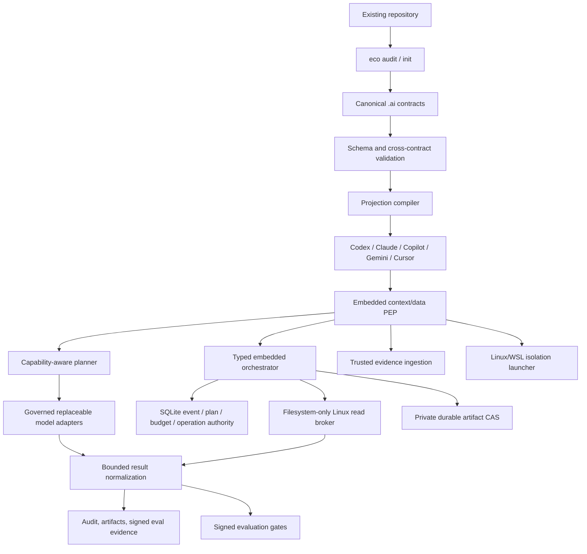

# Architecture

**Status:** M1 and the embedded M2 Linux/WSL read-only reference profile are implemented; M3 controlled writes/approvals are pending.

**Updated:** 2026-07-15

## Logical architecture



Solid lines are implemented. Dashed lines are contracts or future milestones, not current security claims.

## Canonical configuration

| File | Contract |
|---|---|
| `.ai/project.yaml` | Project identity, build/test, protected paths, policy defaults, runtime profile |
| `.ai/instructions.yaml` | Purpose, principles, scoped rules, commands, projection targets |
| `.ai/capabilities.yaml` | Stable capability vocabulary with D/A semantics |
| `.ai/deployments.yaml` | Exact deployments, zones, data classes, trust and logical roles |
| `.ai/tools.yaml` | Tool bindings, capability, action class and sandbox allowlist |

The schemas under `src/eco_cli/schemas/` are normative for `v1alpha1`.

## Projection safety model

Each generated file contains one managed block:

```text
eco:managed:start client=... source=... digest=...
...
eco:managed:end
```

- Existing managed block: update deterministically.
- Missing file: create it.
- Unmanaged file: refuse by default.
- `--adopt`: preserve existing text and append a managed block.
- `--force`: replace after a content-addressed backup under ignored runtime state.
- `uninstall`: remove the block or restore the backup.

This provides ownership and reversibility. It does not prove that different AI clients interpret identical text identically; that requires conformance evaluation.

## Trust boundaries

### Implemented now

- schema and cross-contract validation;
- safe repository-relative paths;
- secret-like literal rejection;
- sanitized validation errors;
- deterministic projections;
- read-only audit;
- lock input hashes;
- automated regression tests.
- embedded immutable-plan PEP, single-use decisions, state machine, and atomic local budgets;
- snapshot-bound Linux/WSL repository reads with negative boundary tests.
- SQLite authority for active plans, deadlines, decision nonces, durable tool/input accounting, fenced read operations, result reconciliation, and deadline recovery.
- durable full-projection event replay, native lifecycle and terminal checkpoints;
- typed PREPARE/read/artifact-fsync/COMMIT orchestration with explicit no-retry crash recovery;
- authenticated migration, database backup/restore, key rotation, and external-anchor protocols.

### Implemented M2 runtime TCB

- orchestrator/store-owned policy/tool authority; the untrusted launcher rejects credential bindings;
- trusted snapshot and observation ingestion;
- governed local/cloud adapter boundaries with identity pinned only to observable evidence;
- Linux/WSL direct-egress denial and clean environment launcher;
- durable audit/artifact authority and signed evaluation verifier.

### Remaining beyond M2

- endpoint-specific network allowlist backend;
- Windows/macOS isolation and filesystem backends;
- action PEP and parameter-bound approvals for A2+;
- descendant-exec/seccomp/cgroup/device containment;
- asymmetric team-verifiable evidence identity.

The embedded capability guards remain process-local and the executable filesystem/isolation proof is Linux/WSL-specific. Evidence HMACs authenticate the embedded issuer boundary but are not remote third-party identities. See [M2 runtime contracts](runtime-contracts.md), [Read-only repository broker](read-only-broker.md), [Durable runtime store](durable-runtime-store.md), [M2 completion report](../research/2026-07-15-m2-completion-report.md), and [D/A/Z/P semantics](policy-semantics.md).

LLMs, prompts, skills, plugins, MCP servers, gateways, generated files, vector indexes, and arbitrary probe workloads are not trusted by default.

## Deployment profiles

1. Embedded CLI: current baseline.
2. Personal local compute: approved workstation, DGX, or another local runtime behind the same adapter and eval contracts.
3. Team: PostgreSQL, shared artifacts, signed policies, RBAC.
4. Enterprise: fleet/multi-tenancy components only after measured need.

## M2 regression profile

M2 remains the read-only regression slice on an external repository:

```text
client without credentials
→ data/context PEP
→ one local and one cloud adapter
→ read-only tool broker
→ sanitized audit trail
→ identical project eval task
```

`odysseus` remains a possible brownfield fixture, not an ecosystem dependency. The active local evaluation profile may run on any governed local machine; the retired DGX snapshot has no privileged role. Cloud model aliases are observable routing identities, not immutable-weight attestations. See ADR-016.

## Next milestone

M3 adds narrowly controlled workspace writes, explicit approvals, idempotency, rollback, and regression tests that preserve every M2 read-only boundary. M2 observations must be renewed after their validity window before they are used for current routing or promotion.

## Sources

- Full research (local source): `/home/snow/projects/rnd-llm-playbook/docs/research/2026-07-14-universal-ai-ecosystem-deep-research.md`
- [JSON Schema 2020-12](https://json-schema.org/draft/2020-12)
- [MCP architecture](https://modelcontextprotocol.io/specification/2025-11-25/architecture)
- [NIST AI RMF](https://www.nist.gov/itl/ai-risk-management-framework)
- [OWASP AI Agent Security Cheat Sheet](https://cheatsheetseries.owasp.org/cheatsheets/AI_Agent_Security_Cheat_Sheet.html)
