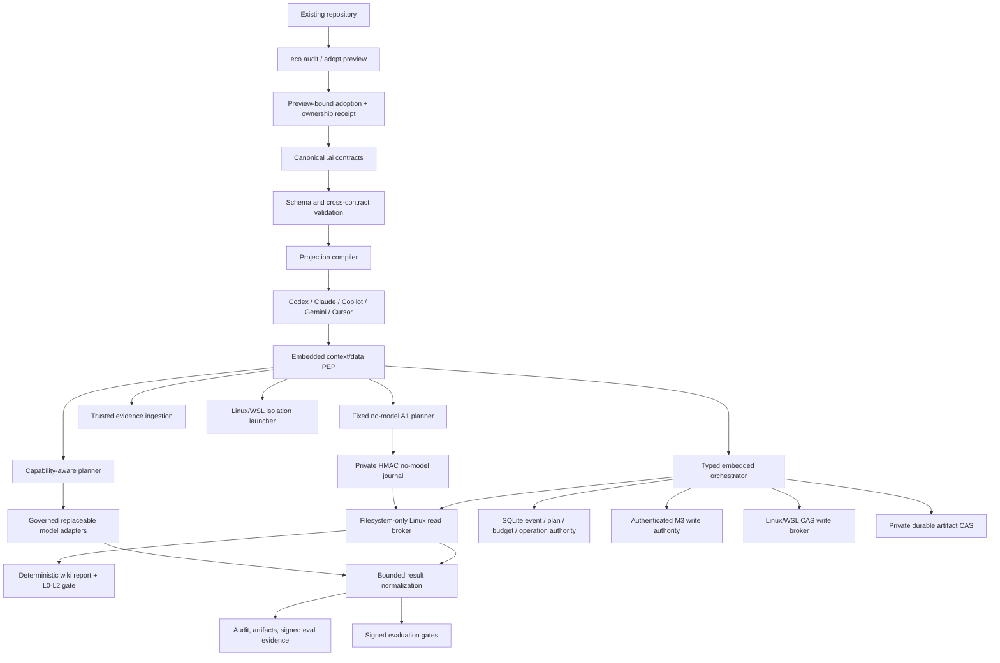

# Architecture

**Status:** M1, embedded M2 read-only, bounded M3 Linux/WSL controlled writes, M3.5/M3.6 integration/trust, the fixed M4 no-model L0–L2 reference loop, and M4.5.1 safe project adoption are implemented.

**Updated:** 2026-07-16

## Logical architecture



Solid lines are implemented. Dashed lines are contracts or future milestones, not current security claims.

## Canonical configuration

| File | Contract |
|---|---|
| `.ai/project.yaml` | Project identity, build/test, protected paths, policy defaults, runtime profile |
| `.ai/instructions.yaml` | Purpose, principles, scoped rules, commands, projection targets |
| `.ai/capabilities.yaml` | Stable capability vocabulary with D/A semantics |
| `.ai/deployments.yaml` | Exact deployments, zones, data classes, trust and logical roles |
| `.ai/tools.yaml` | Tool bindings, capability, action class and sandbox allowlist |

The schemas under `src/eco_cli/schemas/` are normative for `v1alpha1`.

## Projection safety model

Each generated file contains one managed block:

```text
eco:managed:start client=... source=... digest=...
...
eco:managed:end
```

- Existing managed block: update deterministically.
- Missing file: create it.
- Unmanaged file: refuse by default.
- `--adopt`: preserve existing text and append a managed block.
- `--force`: replace after a content-addressed backup under ignored runtime state.
- `uninstall`: remove the block or restore the backup.

This provides ownership and reversibility. It does not prove that different AI clients interpret identical text identically; that requires conformance evaluation.

For installation into another repository, M4.5.1 adds a mandatory zero-write adoption preview, an exact stale-plan digest, byte-bound backup state, and a portable ownership receipt. Full removal validates the complete owned set before the first mutation and never recursively deletes an ambiguous `.ai` tree. See [M4.5.1 safe project adoption](project-adoption.md).

## Trust boundaries

### Implemented now

- schema and cross-contract validation;
- safe repository-relative paths;
- secret-like literal rejection;
- sanitized validation errors;
- deterministic projections;
- read-only audit;
- lock input hashes;
- automated regression tests.
- embedded immutable-plan PEP, single-use decisions, state machine, and atomic local budgets;
- snapshot-bound Linux/WSL repository reads with negative boundary tests.
- SQLite authority for active plans, deadlines, decision nonces, durable tool/input accounting, fenced read operations, result reconciliation, and deadline recovery.
- durable full-projection event replay, native lifecycle and terminal checkpoints;
- typed PREPARE/read/artifact-fsync/COMMIT orchestration with explicit no-retry crash recovery;
- authenticated migration, database backup/restore, key rotation, and external-anchor protocols.
- exact A2 one-file create/replace proposals with parameter-bound human approval and policy decisions;
- separate authenticated write authority with atomic approval/policy consumption, target locks, idempotency and fenced leases;
- Linux/WSL descriptor-anchored compare-and-swap apply/rollback plus restart-safe private-CAS recovery bundles.

### Implemented M2 runtime TCB

- orchestrator/store-owned policy/tool authority; the untrusted launcher rejects credential bindings;
- trusted snapshot and observation ingestion;
- governed local/cloud adapter boundaries with identity pinned only to observable evidence;
- Linux/WSL direct-egress denial and clean environment launcher;
- durable audit/artifact authority and signed evaluation verifier.

### M3.5 integration boundary

`eco runtime doctor --json` now proves that the installed CLI can construct the embedded policy, private store, artifact store, descriptor-anchored snapshot, read broker, and orchestrator as one read-only composition. The probe neither executes a plan nor creates a write authority. `eco runtime trust doctor --json` separately verifies externally signed snapshot/conformance evidence against the canonical `.ai/trust.yaml` policy, with no runtime state, broker or model operation. This turns the former test-only runtime into a verifiable integration boundary without weakening M2/M3 authorization.

Hosted CI validates deterministic contracts and fail-closed unsupported-isolation behavior. Live user/net/pid namespace plus Landlock conformance is exercised only on capable Linux/WSL hosts; an unavailable profile is a visible “not performed” result, never a portable security claim. See the [M3.5 report](../research/2026-07-16-m3.5-integration-reproducibility-report.md).

### M4 no-model loop boundary

`eco run wiki-health-check --json` now consumes M3.6 external signed-snapshot verification through a distinct `NoModelRunPlan`. The plan is path-free, route-free, and fixes three D0/P1 wiki slots, three reads, a 30-second attempt deadline, exact signed input bytes, and zero model/network/workspace-write budgets. Reads receive fresh single-use policy decisions and cross only the existing Linux/WSL descriptor-anchored broker.

A dedicated private external SQLite journal authenticates plan/event/head state with a separately provisioned HMAC key and excludes concurrent owners. Recovery reauthorizes only pre-start `allowed` reads; the durable `started` ambiguity fence turns uncertain post-start recovery into a typed terminal failure without another broker call. Completed observations are restored, terminal success does not repeat broker I/O, and the first event anchors the deadline across recovery. Output and durable state contain no raw path or wiki content.

`eco eval wiki-health-check --json` evaluates five fixed independent journals plus one zero-read replay. Frozen gates can promote only L0–L2. L3–L5 remain explicit ineligible states and create no M3 write, model, network, retry, or scheduling authority. See [M4 no-model wiki health](no-model-wiki-health.md).

### M4.5.1 adoption boundary

`eco adopt --dry-run` discovers descriptive repository metadata and emits a schema-valid content-minimized plan. `eco adopt --apply` serializes cooperating installers, recomputes the plan, preserves unmanaged instruction bytes, validates the completed canonical bundle, and records exact ownership. A clean reinstall is a byte/mtime no-op. Uninstall requires strict projection state and verified backup digest/size; marker text alone grants no ownership. Full config removal refuses drift, unknown entries, and pre-existing canonical files before cleaning any projection.

This filesystem bootstrap has focused Linux/macOS/Windows CI. It does not make the Linux/WSL read broker, isolation launcher, M3 write broker, or M4 loop executor portable.

### Remaining beyond M4

- endpoint-specific network allowlist backend;
- Windows/macOS isolation and filesystem backends;
- Windows/macOS controlled-write backends and conformance evidence;
- delete, rename, directory, batch, command, A3 and A4 action profiles;
- descendant-exec/seccomp/cgroup/device containment;
- asymmetric team-verifiable evidence identity.
- full-wiki link/staleness/duplicate-semantic lint over a separately signed larger scope;
- loop scheduling, autonomous retry, and L3–L5 promotion profiles.
- durable adoption crash recovery and hostile concurrent parent-swap protection;
- versioned platform/adapter capability profiles, native conformance evidence, and portable packaging.

The embedded capability guards remain process-local and the executable filesystem/isolation/write proof is Linux/WSL-specific. Evidence and reference-approval HMACs authenticate configured embedded boundaries but are not remote third-party identities. See [M2 runtime contracts](runtime-contracts.md), [Read-only repository broker](read-only-broker.md), [Durable runtime store](durable-runtime-store.md), [M3 controlled writes](controlled-writes.md), [M3 completion report](../research/2026-07-15-m3-completion-report.md), and [D/A/Z/P semantics](policy-semantics.md).

LLMs, prompts, skills, plugins, MCP servers, gateways, generated files, vector indexes, and arbitrary probe workloads are not trusted by default.

## Deployment profiles

1. Embedded CLI: current baseline.
2. Personal local compute: approved workstation, DGX, or another local runtime behind the same adapter and eval contracts.
3. Team: PostgreSQL, shared artifacts, signed policies, RBAC.
4. Enterprise: fleet/multi-tenancy components only after measured need.

## M2 regression profile

M2 remains the read-only regression slice on an external repository:

```text
client without credentials
→ data/context PEP
→ one local and one cloud adapter
→ read-only tool broker
→ sanitized audit trail
→ identical project eval task
```

`odysseus` remains a possible brownfield fixture, not an ecosystem dependency. The active local evaluation profile may run on any governed local machine; the retired DGX snapshot has no privileged role. Cloud model aliases are observable routing identities, not immutable-weight attestations. See ADR-016.

## Next milestone

The next slice is M4.5.2 platform and adapter conformance: versioned platform profiles, declared-versus-observed capability evidence, and read-only probes for Windows, macOS, Linux, WSL, containers, and hosted CI. Unsupported runtime controls must remain unavailable without fallback. M4.5.3 may add packaging/install adapters only after that evidence boundary is stable.

M5 team authority—signed policy distribution, RBAC/identity, independently authenticated evidence consumption, revocation/rotation, and shared-state conformance—follows the portability work. It must preserve the completed M4 profile without turning L2 evidence into implicit scheduling, model, network, or write authority.

## Sources

- Full research (local source): `/home/snow/projects/rnd-llm-playbook/docs/research/2026-07-14-universal-ai-ecosystem-deep-research.md`
- [JSON Schema 2020-12](https://json-schema.org/draft/2020-12)
- [MCP architecture](https://modelcontextprotocol.io/specification/2025-11-25/architecture)
- [NIST AI RMF](https://www.nist.gov/itl/ai-risk-management-framework)
- [OWASP AI Agent Security Cheat Sheet](https://cheatsheetseries.owasp.org/cheatsheets/AI_Agent_Security_Cheat_Sheet.html)
