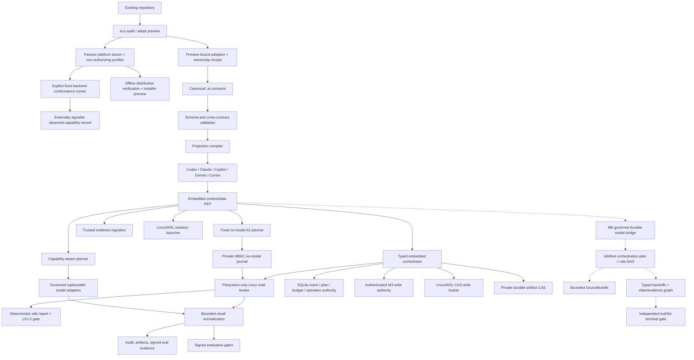

# Architecture

**Status:** M1–M6.7 are implemented for the bounded reference profile. M6.8
deterministic release conformance is in progress; a live five-role model PASS is
an explicit optional-provider nonclaim.

**Updated:** 2026-07-20

## Logical architecture



Solid lines are implemented. Dashed lines are contracts or future milestones, not current security claims.

## Canonical configuration

| File | Contract |
|---|---|
| `.ai/project.yaml` | Project identity, build/test, protected paths, policy defaults, runtime profile |
| `.ai/instructions.yaml` | Purpose, principles, scoped rules, commands, projection targets |
| `.ai/capabilities.yaml` | Stable capability vocabulary with D/A semantics |
| `.ai/deployments.yaml` | Exact deployments, zones, data classes, trust and logical roles |
| `.ai/tools.yaml` | Tool bindings, capability, action class and sandbox allowlist |

The schemas under `src/eco_cli/schemas/` are normative for `v1alpha1`.

## Projection safety model

Each generated file contains one managed block:

```text
eco:managed:start client=... source=... digest=...
...
eco:managed:end
```

- Existing managed block: update deterministically.
- Missing file: create it.
- Unmanaged file: refuse by default.
- `--adopt`: preserve existing text and append a managed block.
- `--force`: replace after a content-addressed backup under ignored runtime state.
- `uninstall`: remove the block or restore the backup.

This provides ownership and reversibility. It does not prove that different AI clients interpret identical text identically; that requires conformance evaluation.

For installation into another repository, M4.5.1 adds a mandatory zero-write adoption preview, an exact stale-plan digest, byte-bound backup state, and a portable ownership receipt. Full removal validates the complete owned set before the first mutation and never recursively deletes an ambiguous `.ai` tree. See [M4.5.1 safe project adoption](project-adoption.md).

## Trust boundaries

### Implemented now

- schema and cross-contract validation;
- safe repository-relative paths;
- secret-like literal rejection;
- sanitized validation errors;
- deterministic projections;
- read-only audit;
- lock input hashes;
- automated regression tests.
- embedded immutable-plan PEP, single-use decisions, state machine, and atomic local budgets;
- snapshot-bound Linux/WSL repository reads with negative boundary tests.
- SQLite authority for active plans, deadlines, decision nonces, durable tool/input accounting, fenced read operations, result reconciliation, and deadline recovery.
- durable full-projection event replay, native lifecycle and terminal checkpoints;
- typed PREPARE/read/artifact-fsync/COMMIT orchestration with explicit no-retry crash recovery;
- authenticated migration, database backup/restore, key rotation, and external-anchor protocols.
- exact A2 one-file create/replace proposals with parameter-bound human approval and policy decisions;
- separate authenticated write authority with atomic approval/policy consumption, target locks, idempotency and fenced leases;
- Linux/WSL descriptor-anchored compare-and-swap apply/rollback plus restart-safe private-CAS recovery bundles.

### Implemented M2 runtime TCB

- orchestrator/store-owned policy/tool authority; the untrusted launcher rejects credential bindings;
- trusted snapshot and observation ingestion;
- governed local/cloud adapter boundaries with identity pinned only to observable evidence;
- Linux/WSL direct-egress denial and clean environment launcher;
- durable audit/artifact authority and signed evaluation verifier.

### M3.5 integration boundary

`eco runtime doctor --json` now proves that the installed CLI can construct the embedded policy, private store, artifact store, descriptor-anchored snapshot, read broker, and orchestrator as one read-only composition. The probe neither executes a plan nor creates a write authority. `eco runtime trust doctor --json` separately verifies externally signed snapshot/conformance evidence against the canonical `.ai/trust.yaml` policy, with no runtime state, broker or model operation. This turns the former test-only runtime into a verifiable integration boundary without weakening M2/M3 authorization.

Hosted CI validates deterministic contracts and fail-closed unsupported-isolation behavior. Live user/net/pid namespace plus Landlock conformance is exercised only on capable Linux/WSL hosts; an unavailable profile is a visible “not performed” result, never a portable security claim. See the [M3.5 report](../research/2026-07-16-m3.5-integration-reproducibility-report.md).

### M4 no-model loop boundary

`eco run wiki-health-check --json` now consumes M3.6 external signed-snapshot verification through a distinct `NoModelRunPlan`. The plan is path-free, route-free, and fixes three D0/P1 wiki slots, three reads, a 30-second attempt deadline, exact signed input bytes, and zero model/network/workspace-write budgets. Reads receive fresh single-use policy decisions and cross only the existing Linux/WSL descriptor-anchored broker.

A dedicated private external SQLite journal authenticates plan/event/head state with a separately provisioned HMAC key and excludes concurrent owners. Recovery reauthorizes only pre-start `allowed` reads; the durable `started` ambiguity fence turns uncertain post-start recovery into a typed terminal failure without another broker call. Completed observations are restored, terminal success does not repeat broker I/O, and the first event anchors the deadline across recovery. Output and durable state contain no raw path or wiki content.

`eco eval wiki-health-check --json` evaluates five fixed independent journals plus one zero-read replay. Frozen gates can promote only L0–L2. L3–L5 remain explicit ineligible states and create no M3 write, model, network, retry, or scheduling authority. See [M4 no-model wiki health](no-model-wiki-health.md).

### M4.5.1 adoption boundary

`eco adopt --dry-run` discovers descriptive repository metadata and emits a schema-valid content-minimized plan. `eco adopt --apply` serializes cooperating installers, recomputes the plan, preserves unmanaged instruction bytes, validates the completed canonical bundle, and records exact ownership. A clean reinstall is a byte/mtime no-op. Uninstall requires strict projection state and verified backup digest/size; marker text alone grants no ownership. Full config removal refuses drift, unknown entries, and pre-existing canonical files before cleaning any projection.

This filesystem bootstrap has focused Linux/macOS/Windows CI. It does not make the Linux/WSL read broker, isolation launcher, M3 write broker, or M4 loop executor portable.

### M4.5.2 platform and adapter boundary

`eco platform doctor --json` now reports a bounded OS/context, allowlisted executable-name, and fixed client-surface inventory. It never executes a discovered binary, reads projection content, contacts an adapter, resolves a credential, writes a file, or creates runtime authority. Mutable hints cannot prove WSL/container/CI identity, and overlapping strong contexts fail as ambiguous.

The closed `PlatformProfile` and `AdapterCapabilityProfile` schemas separate declaration, passive detection, and authenticated proof. In this passive version, profile proof is null, every runtime-security capability is `not-tested`, and effective capability sets are structurally empty. Existing externally signed runtime `AdapterConformanceProfile` evidence remains the only proof form consumed by policy. See [M4.5.2 platform and adapter conformance](platform-adapter-conformance.md).

### M4.5.3 distribution boundary

The wheel-only `DistributionManifest` binds the exact main/dependency wheelhouse, `uv.lock`, source revision and packaged schema inventory. Both installed and standard-library verifiers are offline/read-only; package-manager adapters are deterministic previews with `executionReady: false`. A real Linux CI gate builds, verifies and installs a fresh private virtual environment without an index. Manifest integrity is explicitly not publisher authentication, and installing the CLI remains separate from project adoption. See [M4.5.3 portable distribution](portable-distribution.md).

### M4.6 active conformance boundary

`eco conformance run` accepts only a fixed synthetic Linux/WSL namespace + Landlock suite in an operator-created external private root. The resulting `PlatformBackendConformanceProfile` binds exact platform/distribution/backend/runner/suite identities and uses `observedCapabilities`, never effective authority. External envelope ingestion verifies the record but no policy/store/broker/adapter/loop consumes it in M4.6. See [M4.6 platform backend conformance](platform-backend-conformance.md).

### M5 team-authority boundary

The separate `authority.ai.ecosystem/v1alpha1` namespace describes teams, principals, memberships, public keys, exact access policy, approval profiles and revisioned signed bundles. Ed25519 verification is relative to a caller-supplied external anchor without self-bootstrap. A private HMAC-authenticated SQLite authority establishes currentness using monotonic revisions, exact predecessor/snapshot CAS, epochs and serialized writers.

Runtime authorization is an intersection: trusted current `PolicyEngine` allow, current signed team-access allow candidate, active non-revoked signed actor state, emergency-clear state and an authority-issued single-use A2 permit when required. Explicit deny wins. Quorum uses distinct eligible human principals and excludes the requester. Emergency disable has its own signed recovery quorum. Trust-anchor rotation requires both old and new signatures and creates a new successor authority generation without rewriting history. See [M5 team authority](team-authority.md), the [operations runbook](../operations/team-authority-runbook.md), and the [completion report](../research/2026-07-16-m5-team-authority-completion-report.md).

### M6.0 functional-orchestration boundary

ADR-027 re-sequences the roadmap: M6 now builds useful vendor-neutral skills,
loops, roles, memory and workload-agent teams above the M1–M5 enforcement
foundation; the former enterprise/network M6 moves unchanged to M7. ADR-028 adds
the separate `orchestration.ai.ecosystem/v1alpha1` registry rather than widening
existing runtime or authority records.

The first profile is a manual offline `source-review` with the fixed sequence
planner → analyst → verifier → synthesizer → reviewer, one possible bounded
revision and no source-network, tools or workspace writes. A durable governed model
operation must exist before the workflow may call an adapter. All source and model
output remains P0; typed handoffs and a deterministic runtime gate own completion.

The fixed workflow, governed model bridge and typed source/evidence graph are now
implemented. Production execution requires an authenticated exact M6.4 route;
every provider effect re-verifies Ed25519 route authority and atomically reserves
aggregate usage before egress. See
[functional orchestration](functional-orchestration.md), the
[threat model](m6-functional-orchestration-threat-model.md) and the
[M6.0 plan](../research/2026-07-17-m6.0-functional-orchestration-plan.md).

The bounded M6.2 package-owned registry and deterministic client projection
lifecycle are specified in
[skills and harness synchronization](skills-harness-sync.md). Skill guidance and
filesystem ownership do not grant runtime authority.

M6.4 adds a separate pure deterministic router with five canonical workload roles,
digest-bound policy/evidence/price inputs, router-calculated cost reservation,
sanitized explanations and retryable-only explicit fallback. A route is not model
authority: the exact selected binding must still cross the M6.1 policy/store/model
bridge. The `m6.1-local-zero-cost` profile remains local-only and zero-cost. See
[logical model roles and deterministic routing](model-role-routing.md).

M6.5 adds a separate `memory.ai.ecosystem/v1alpha1` plane. Raw/private context
stays in the private CAS; the SQLite journal stores only sealed artifact bindings
and HMAC-authenticated provenance. Retrieval requires exact project/team/run
namespace, data/P class, TTL, caller-owned policy and hard item/byte/token-estimate
budgets. Conflict/refutation components are atomic and compaction is additive and
reversible. Memory is never an authority source. See
[private context and memory](private-context-memory.md).

M6.6 adds the `teams.ai.ecosystem/v1alpha1` plane and an embedded durable
coordinator. Exact M5-bound manifests, narrowed child delegation, serialized
task leases, aggregate reservations, single-use routes, typed artifact handoffs,
cancellation and truthful partial failure are enforced at runtime. A scheduler
claim and a route remain non-authorizing; the exact effect must cross a separate
current runtime authorization. See [general agent teams](general-agent-teams.md).

M6.7 adds a separate `research.ai.ecosystem/v1alpha1` policy/capability/request/
artifact plane. Brokered public-HTTPS search/fetch binds domains, redirects,
wire/decoded size, media, absolute time, credential-free query policy, data class,
egress and retention before network access. Retrieved UTF-8 bytes enter private
CAS with digest-only provenance and remain explicitly untrusted. See
[governed research tools](governed-research-tools.md).

### Remaining after the bounded M6 profile

- hosted M6.8 matrix and offline installed-wheel evidence for the `0.8.0`
  release candidate;
- a full live five-role PASS on a sufficiently capable optional local/provider
  model; prior dogfood proved the enforcement chain but not model quality;

- endpoint-specific network allowlist backend;
- Windows/macOS isolation and filesystem backends;
- Windows/macOS controlled-write backends and conformance evidence;
- delete, rename, directory, batch, command, A3 and A4 action profiles;
- descendant-exec/seccomp/cgroup/device containment;
- PostgreSQL/network authority, SSO/OIDC/WebAuthn, KMS/HSM/Vault, HA/consensus and multi-region recovery;
- native Windows ACL enforcement and native macOS/Windows runtime-security backends;
- remote transactional effect adapters and separately threat-modeled A3/A4 profiles;
- full-wiki link/staleness/duplicate-semantic lint over a separately signed larger scope;
- loop scheduling, autonomous retry, and L3–L5 promotion profiles.
- durable adoption crash recovery and hostile concurrent parent-swap protection;
- publisher-authenticated release provenance, immutable verified-byte installer staging and transactional multi-manager rollback;
- native Windows/macOS backend runners and any runtime consumer of M4.6 observations.

The embedded capability guards remain process-local and the executable filesystem/isolation/write proof is Linux/WSL-specific. Evidence and reference-approval HMACs authenticate configured embedded boundaries but are not remote third-party identities. See [M2 runtime contracts](runtime-contracts.md), [Read-only repository broker](read-only-broker.md), [Durable runtime store](durable-runtime-store.md), [M3 controlled writes](controlled-writes.md), [M3 completion report](../research/2026-07-15-m3-completion-report.md), and [D/A/Z/P semantics](policy-semantics.md).

LLMs, prompts, skills, plugins, MCP servers, gateways, generated files, vector indexes, and arbitrary probe workloads are not trusted by default.

## Deployment profiles

1. Embedded CLI: current baseline.
2. Personal local compute: approved workstation, DGX, or another local runtime behind the same adapter and eval contracts.
3. Team: PostgreSQL, shared artifacts, signed policies, RBAC.
4. Enterprise: fleet/multi-tenancy components only after measured need.

## M2 regression profile

M2 remains the read-only regression slice on an external repository:

```text
client without credentials
→ data/context PEP
→ one local and one cloud adapter
→ read-only tool broker
→ sanitized audit trail
→ identical project eval task
```

`odysseus` remains a possible brownfield fixture, not an ecosystem dependency. The active local evaluation profile may run on any governed local machine; the retired DGX snapshot has no privileged role. Cloud model aliases are observable routing identities, not immutable-weight attestations. See ADR-016.

## Next milestone

M6.1a is the next executable gate: exact model authorization plus durable
PREPARE/start/complete/fail accounting and conservative recovery. Only after that
bridge passes can M6.1b expose the fixed `eco team run source-review` workflow.
M5 exact team access remains a narrowing intersection with the existing
`PolicyEngine`; orchestration records, L2 history, passive profiles, package
checksums, observations and inactive signed bundles cannot become implicit model,
network, scheduling or write authority.

## Sources

- Full research (local source): `/home/snow/projects/rnd-llm-playbook/docs/research/2026-07-14-universal-ai-ecosystem-deep-research.md`
- [JSON Schema 2020-12](https://json-schema.org/draft/2020-12)
- [MCP architecture](https://modelcontextprotocol.io/specification/2025-11-25/architecture)
- [NIST AI RMF](https://www.nist.gov/itl/ai-risk-management-framework)
- [OWASP AI Agent Security Cheat Sheet](https://cheatsheetseries.owasp.org/cheatsheets/AI_Agent_Security_Cheat_Sheet.html)
