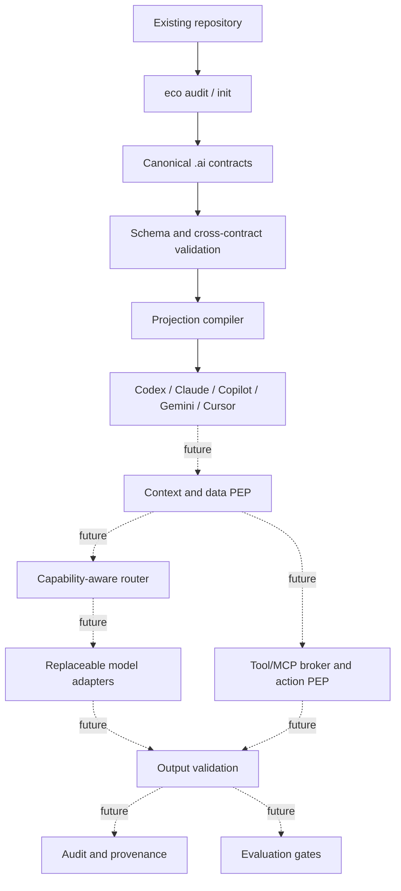

# Architecture

**Status:** M1 contracts/compiler implemented; runtime enforcement is future work.  
**Updated:** 2026-07-14

## Logical architecture



Solid lines are implemented. Dashed lines are contracts or future milestones, not current security claims.

## Canonical configuration

| File | Contract |
|---|---|
| `.ai/project.yaml` | Project identity, build/test, protected paths, policy defaults, runtime profile |
| `.ai/instructions.yaml` | Purpose, principles, scoped rules, commands, projection targets |
| `.ai/capabilities.yaml` | Stable capability vocabulary with D/A semantics |
| `.ai/deployments.yaml` | Exact deployments, zones, data classes, trust and logical roles |
| `.ai/tools.yaml` | Tool bindings, capability, action class and sandbox allowlist |

The schemas under `src/eco_cli/schemas/` are normative for `v1alpha1`.

## Projection safety model

Each generated file contains one managed block:

```text
eco:managed:start client=... source=... digest=...
...
eco:managed:end
```

- Existing managed block: update deterministically.
- Missing file: create it.
- Unmanaged file: refuse by default.
- `--adopt`: preserve existing text and append a managed block.
- `--force`: replace after a content-addressed backup under ignored runtime state.
- `uninstall`: remove the block or restore the backup.

This provides ownership and reversibility. It does not prove that different AI clients interpret identical text identically; that requires conformance evaluation.

## Trust boundaries

### Implemented now

- schema and cross-contract validation;
- safe repository-relative paths;
- secret-like literal rejection;
- sanitized validation errors;
- deterministic projections;
- read-only audit;
- lock input hashes;
- automated regression tests.

### Future runtime TCB

- context/data Policy Enforcement Point;
- broker-owned provider/tool credentials;
- network egress enforcement;
- action PEP and parameter-bound approval;
- sandbox launcher;
- audit writer and signed verifier.

LLMs, prompts, skills, plugins, MCP servers, gateways, generated files, vector indexes, and arbitrary probe workloads are not trusted by default.

## Deployment profiles

1. Embedded CLI: current baseline.
2. Personal DGX: local adapters and eval runner.
3. Team: PostgreSQL, shared artifacts, signed policies, RBAC.
4. Enterprise: fleet/multi-tenancy components only after measured need.

## Next milestone

M2 is a read-only vertical slice on an external repository:

```text
client without credentials
→ data/context PEP
→ one local and one cloud adapter
→ read-only tool broker
→ sanitized audit trail
→ identical project eval task
```

`odysseus` is the proposed brownfield fixture. DGX Spark is the local execution/evaluation profile, not a control-plane dependency.

## Sources

- Full research (local source): `/home/snow/projects/rnd-llm-playbook/docs/research/2026-07-14-universal-ai-ecosystem-deep-research.md`
- [JSON Schema 2020-12](https://json-schema.org/draft/2020-12)
- [MCP architecture](https://modelcontextprotocol.io/specification/2025-11-25/architecture)
- [NIST AI RMF](https://www.nist.gov/itl/ai-risk-management-framework)
- [OWASP AI Agent Security Cheat Sheet](https://cheatsheetseries.owasp.org/cheatsheets/AI_Agent_Security_Cheat_Sheet.html)
