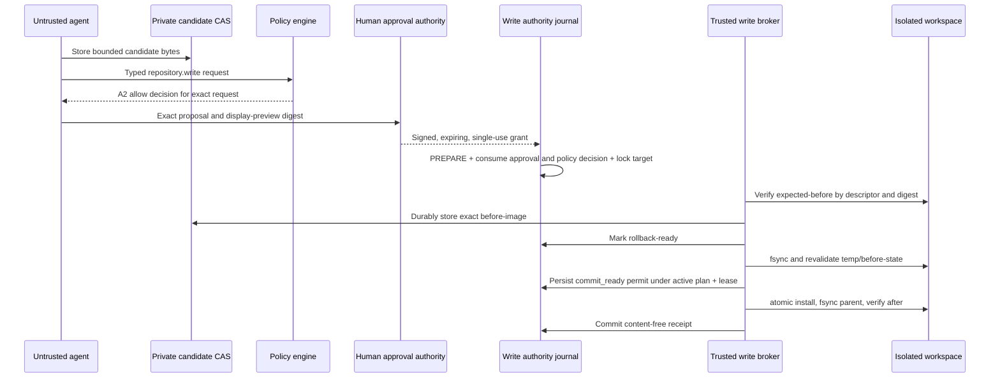

# M3 controlled workspace writes

**Status:** implemented bounded Linux/WSL reference profile

**Updated:** 2026-07-15

## Boundary

M3 adds one portable logical capability with one currently implemented backend:

| Property | M3 Linux/WSL profile |
|---|---|
| Action class | A2 |
| Tool | `repository.write` |
| Operations | one-file `create` or `replace` |
| Plan scope | dedicated `repository.write`-only plan |
| Content | bounded UTF-8 regular file, no NUL |
| Parent | must already exist below the governed workspace |
| Agent access | candidate scratch/CAS only; no writable governed workspace |
| Network | denied |
| Approval | exact, expiring, single-use, authenticated human grant |
| Apply | compare-and-swap precondition plus atomic same-directory install |
| Rollback | compare-and-swap against the exact applied digest |
| Audit | authenticated content-free write-authority journal |

Delete, rename, directory creation, batches, arbitrary commands, live-root promotion and A3/A4 actions are not implicit extensions of this profile.

## Authority flow



No prompt, generated instruction, plugin, MCP server or client confirmation is an approval authority. Policy allow and human approval are separate: policy establishes that an operation is permitted in principle; approval authorizes one exact proposed effect.

## Exact approval subject

The approval subject is a canonical digest over the write-journal identity, project and run, plan digest, proposal digest, A2 action, root/base identity, keyed target reference, desired and rollback manifests, display-summary digest and byte/time limits. Every field is mandatory. A path, content, size, before-state, plan, preview, expiry or rollback change produces a different subject and requires a new grant.

The embedded HMAC signer is a reference verifier with a configured key-to-human mapping. The runtime journal HMAC cannot manufacture a human grant. Team deployments must connect the same verification interface to an authenticated human system such as WebAuthn or an OIDC-backed approval service and retain its independent evidence.

## Filesystem protocol

The broker owns a descriptor for the trusted root and resolves below it with the Linux `openat2` no-cross-device/no-symlink policy. It rejects protected paths, non-canonical paths, missing parents, mount changes, symlinks, special files and targets with multiple hard links. Immediately before the atomic namespace mutation, the runtime store holds a cross-connection `BEGIN IMMEDIATE` active-plan guard while the change authority atomically persists `commit_ready` under the fenced unexpired lease. Run termination therefore cannot interleave between active-plan validation and permit issuance. That durable state is the one-shot commit permit: a stop or lease expiry after it does not retroactively revoke the immediately following atomic rename. If the worker cannot record `applied`, recovery treats `commit_ready` as ambiguous, observes the exact state and rolls an installed after-image back.

For `create`, the exact precondition is absence. For `replace`, the exact precondition is a stable regular file whose length and SHA-256 match the proposal. Candidate and before-image availability are verified before mutation. The candidate is copied into an exclusive temporary file in the target directory, validated, fsynced, and atomically installed only after a second precondition check. The parent directory is fsynced and the installed file is reopened and hashed before success is recorded.

Rollback never means “write the old bytes regardless”. It succeeds only when the current target still equals the exact M3 after-image. A created file is then removed, or a replaced file is restored atomically from the authenticated before-image. If another actor changed the file, the broker returns a conflict and the durable operation enters `recovery_required` without overwriting that actor's work.

## Durable states and recovery

The write journal is distinct from the M2 schema-v3 read journal. This preserves the proven M2 authority and avoids an implicit migration across a new human-approval boundary.

```text
proposal_registered
  -> approval_issued
  -> prepared
  -> rollback_ready
  -> applying
  -> commit_ready
  -> applied

applied -> rolling_back -> rolled_back
any uncertain filesystem observation -> recovery_required
```

An idempotency key is bound to the immutable intent. Repeating the same key and intent returns the same operation metadata, including after approval and decision expiry; using the key for different content fails. Approval consumption, policy-decision consumption, operation creation and target locking are one SQLite transaction. The active durable plan is checked during proposal creation and again inside the broker's pre-mutation callback. Lease epochs fence stale workers, and transition time advances with monotonic elapsed time so a slow postcondition cannot reuse a stale PREPARE timestamp.

The private CAS contains a canonical recovery bundle with the root identity, raw path, authenticated candidate/before-image references and an unguessable exact temporary filename; SQLite stores only its opaque reference, digest and length. Before mutation, `rollback_ready` atomically switches the operation to the complete recovery bundle. A killed process can therefore leave only one authority-named temp, which recovery removes by exact descriptor-relative name—never by prefix scan. After process loss, a new worker re-verifies the approved root, CAS object and every authority binding, claims an expired fenced lease, cleans the exact orphan and compares the live target with exact before/after states. Exact before becomes terminal `failed` without target mutation. Exact after is conservatively rolled back. Every other state remains `recovery_required` with a durable conflict reason and is never overwritten or reported as success.

Raw target paths, file content, diffs, credentials and provider bodies are forbidden from the write journal, its WAL and audit entries. The journal stores keyed target references, canonical record digests, opaque CAS recovery references, states, leases and receipt digests only. Candidate, preview, recovery metadata and backup bytes remain in private artifact storage outside the governed repository.

## M3 exit criteria

1. An exact unexpired single-use human grant is required in addition to policy allow.
2. Tampering with any bound parameter invalidates the grant.
3. Traversal, protected paths, symlink/hardlink/mount aliases and changed preconditions fail before mutation.
4. Candidate and rollback bytes are durable and verified before the governed file changes.
5. Apply is atomic and verified; no partial file is reported as success.
6. Same-intent retries have at most one physical effect; conflicting reuse fails.
7. Rollback restores the exact before-state and refuses to overwrite unrelated edits.
8. Restart recovery marks exact before as failed, rolls exact after back, and leaves every unrelated state as explicit `recovery_required`.
9. SQLite/audit contain no raw paths or content and detect tampering.
10. All M2 tests and validation/render/doctor gates remain green.

The separate change authority enforces `maxToolRequests` only for dedicated write-only plans. A mixed read/write plan is rejected, preventing split accounting between the M2 and M3 journals.

## Related decisions

- [ADR-009](../decisions/README.md#adr-009--runtime-contracts-and-immutable-policy-binding)
- [ADR-011](../decisions/README.md#adr-011--transactional-safe-record-journal)
- [ADR-017](../decisions/README.md#adr-017--exact-approval-and-compare-and-swap-controlled-writes)
