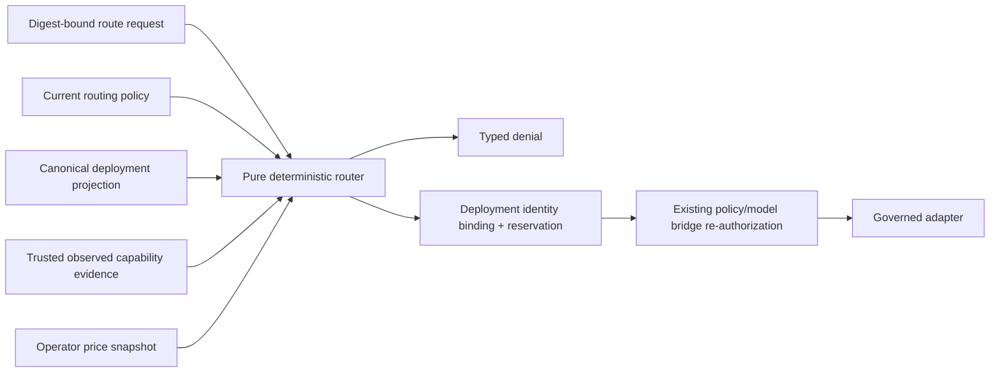

# M6.4 Logical Model Roles and Deterministic Routing

**Status:** implemented as an additive, pure routing library in the working tree;
focused conformance is complete, while integrated M6 release evidence remains an
M6.8 gate.

**Updated:** 2026-07-17

## Purpose

M6.4 turns “use a strong model” or “fallback to another provider” into a closed,
replayable decision. It does not let a prompt, model response, deployment label or
provider error choose its own route.

The five canonical workload roles are:

1. `eco-orchestrator` — decomposition and bounded coordination;
2. `eco-worker` — general typed execution;
3. `eco-grader` — independent rubric/gate evaluation;
4. `eco-researcher` — evidence-oriented research work;
5. `eco-coder` — code-oriented analysis and proposals.

These are logical workload roles, not M5 human/team identities and not provider
names. A role narrows capability and policy; it grants no model, tool, network or
write authority.

## Additive contract family

`routing.ai.ecosystem/v1alpha1` is separate from both the runtime and orchestration
registries:

| Kind | Meaning |
|---|---|
| `ModelRoutingPolicy` | deny-by-default role/action/data/zone/retention/cost and fallback limits |
| `ObservedModelCapabilities` | identity-bound, expiring capability/context/latency observation |
| `TrustedPriceCatalog` | operator-owned, immutable, validity-bounded price snapshot |
| `ModelRouteRequest` | content-free role, workload, context, privacy, budget and deadline request |
| `ModelRouteDecision` | selected deployment binding or typed denial |
| `RoutingExplain` | sanitized candidate digests and fixed reason codes only |

Every record has a domain-separated semantic digest. Policy and price definitions
are revisioned. The router deep-copies and validates them at construction, so later
caller mutation cannot alter a decision. Price entries bind both deployment ID and
the full observable deployment-identity digest; an alias without an exact identity
binding is not a price.

The schema bundle digest for this implementation is
`a98ff4380a066dc67dab7cb4116ec250141c672c5bc6b9820a22e3032967e5b0`.
It is an additive registry digest, not a change to the existing runtime schema
bundle.

## Routing input and authority



`DeploymentCandidate.from_canonical_deployment()` reuses the existing canonical
deployment identity calculation but deliberately drops the endpoint reference.
The router never resolves an endpoint, reads a credential, contacts a provider or
calls an adapter. An allowed route is only an input to the M6.1 model bridge; it is
not execution authority by itself.

`ObservedModelCapabilities` is accepted as a trusted-boundary record only after an
external evidence verifier establishes its envelope, issuer, suite and expiry.
The routing schema preserves only their digests. A self-authored JSON object does
not become trustworthy merely because it validates structurally.

## Exact selection algorithm

For every candidate, the router intersects:

- canonical logical role and requested action class;
- effective data class;
- role, request and deployment zone limits;
- role, request and deployment retention limits;
- explicit cloud permission;
- current deployment identity;
- non-expired observed capabilities;
- required capability set and context-window ceiling;
- trusted price entry for that exact identity;
- request and role cost ceilings;
- observed p95 latency and request deadline;
- explicit exclusion created by an authorized fallback.

An ineligible candidate receives only fixed reason codes such as
`data-class-denied`, `zone-denied`, `capability-evidence-stale`,
`provider-identity-drift`, `cost-denied` or `deadline-insufficient`. If no
candidate survives, the result is a schema-valid `denied` decision with
`no-eligible-candidate`; there is no implicit default provider.

Eligible candidates use the stable tuple:

```text
(router-computed reserved cost,
 observed p95 latency,
 policy candidate preference,
 candidate identity digest)
```

The final digest breaks all ties. Candidate and observation input order therefore
cannot change the result.

For cloud routes, reserved micro-USD is computed inside the router from the
trusted catalog's exact input/output rates, fixed request price and the plan-owned
input/output token ceilings. The request can only narrow the maximum spend; it
cannot assert its own rate or final reservation.

## M6.1 compatibility

The `m6.1-local-zero-cost` execution profile is intentionally stricter than the
general M6.4 router:

- `allowCloud` must be false;
- the request maximum must be zero;
- only a canonical `local` deployment is eligible;
- its trusted calculated reservation must equal zero.

This preserves the fixed M6.1 local-loopback, zero-cost profile. Adding cloud
candidates to a policy cannot silently widen an M6.1 request.

## Fallback

Fallback is a second policy decision, never an adapter default:

| Failure class | Fallback |
|---|---|
| `capacity` | only when explicitly allowed by the role policy |
| `transport-retryable` | only when explicitly allowed by the role policy |
| policy/privacy/authority | never |
| schema/ambiguous outcome | never |
| provider identity drift | never |
| budget/deadline | never |

The prior allowed decision and request digest must match. The attempted candidate
is excluded. Current policy, price validity, observed evidence, identity, cost and
deadline are evaluated again, producing a new decision bound to the prior digest.
The reference policy permits at most two route attempts. A caller/provider message
does not classify a failure; production composition must supply the code-owned
failure class from the governed model bridge and journal it with the decision.

## Sanitized explanation

`RoutingExplain` contains request/policy/catalog digests, candidate digests,
eligibility outcomes, reason codes and an opaque rank digest. It contains no:

- source text, prompt, context or model output;
- deployment ID, provider/model name or raw price;
- endpoint/secret reference or credential;
- observed-evidence path or raw envelope.

`ModelRouteDecision` contains the selected deployment ID because the policy/model
bridge needs that exact binding, but still contains no endpoint or credential.

## Verification

`tests/test_m6_routing.py` covers:

- schema/digest validation and exact five-role policy;
- deterministic candidate/observation permutation behavior;
- action/data/zone/retention/context/cost/deadline denials;
- missing/stale evidence and price catalogs;
- deployment/observation/price identity drift;
- immutable price snapshots and router-computed reservations;
- local zero-cost profile preservation;
- no-candidate typed denial;
- retryable-only fallback, second-decision binding and fresh evidence;
- no fallback for policy/privacy/authority/schema/ambiguous/budget failures;
- sanitized explain leak canaries.

Focused result on 2026-07-17: 21 tests pass, including all 36 order-pair
permutations of a three-candidate fixture. Full-repository and release
conformance remain part of the parent M6 integration gate.

## Explicit non-claims

M6.4 does **not** claim:

- current or representative live provider prices;
- measured live provider/model performance, quality or availability;
- immutable cloud model weights behind a provider alias;
- endpoint resolution, credential custody or network allowlisting;
- durable decision issuance/consumption by this pure library;
- permission to invoke a model, tool, network or workspace write;
- safe fallback from ambiguous or policy-related failures;
- semantic equivalence between providers or OpenAI-compatible endpoints;
- that structural evidence JSON authenticates its own issuer.

Those claims require the existing evidence trust boundary, the M6.1 durable model
bridge and later M6.8 conformance/release evidence.
