# M4 no-model wiki-health profile

**Status:** implemented for the embedded Linux/WSL reference profile
**Updated:** 2026-07-16

## Purpose

`wiki-health-check` is the first executable loop profile. It proves that the ecosystem can plan, authorize, execute, journal, replay, evaluate, and promote a useful repository observation without selecting or invoking any AI model.

The current health definition is deliberately narrow and deterministic:

1. verify an externally signed, fresh repository snapshot;
2. require exactly `wiki/index.md`, `wiki/architecture.md`, and `wiki/roadmap.md` as D0/P1 entries classified by policy;
3. read those entries only through `RepositoryReadBroker`;
4. verify exact digest/length, bounded UTF-8 text, one H1 outside fenced code per document, and three distinct document digests;
5. emit only counts, status, digests, fixed reason codes, and safety assertions.

It does not yet crawl every wiki page, resolve every Markdown link, decide whether prose is semantically stale, or propose edits. Those are separate future profiles because they require a larger signed scope and new evaluator fixtures.

## Enforced flow

```mermaid
flowchart LR
    CLI["eco run / eval wiki-health-check"] --> TRUST["external signed snapshot verification"]
    TRUST --> PLAN["NoModelRunPlan: A1, fixed scope, zero model/network/write budget"]
    PLAN --> POLICY["single-use expiring plan/read decisions"]
    POLICY --> JOURNAL["private external HMAC SQLite journal"]
    JOURNAL --> BROKER["Linux/WSL openat2 read broker"]
    BROKER --> CHECKS["in-memory deterministic checks"]
    CHECKS --> REPORT["path/content-free report digest"]
    REPORT --> EVAL["5 independent attempts + zero-read replay"]
    EVAL --> L2["maximum eligible level: L2"]
```

There is no model route or adapter lifecycle in this flow. `NoModelRunRequest`, `NoModelRunPlan`, and `NoModelReadRequest` are separate versioned contracts; the model-routed `RunPlan` is never repurposed.

## Fixed authority and budgets

| Boundary | Enforced value |
|---|---|
| Workflow | `wiki-health-check` only |
| Repository entries | Exactly three code-owned paths |
| Data/trust | D0 / P1 / classification authority `policy` |
| Action class | A1 |
| Read requests | 3 |
| Wall clock | 30 seconds per attempt |
| Input bytes | Exact signed sum, bounded by three 16 MiB profile entries |
| Model requests | 0 |
| Network requests | 0; no network component is constructed |
| Workspace writes | 0; no write authority is constructed |
| Adapter | none |

The CLI exposes no path, provider, model, deployment, adapter, endpoint, retry-count, threshold, or workflow-file argument. Extending any of those is a contract/version change.

## Journal and replay

`ECO_RUNTIME_STATE_DIR` must name an existing absolute external directory. On POSIX it must be owned by the process user and inaccessible to group/other users. Repository-resident, relative, symlinked, hardlinked, non-regular, wrong-owner, wrong-permission, wrong-application-id, wrong-schema, or unexpected SQLite objects fail closed.

`ECO_RUNTIME_JOURNAL_HMAC_KEY` is a separate operator-provisioned secret of at least 32 bytes. Domain-separated HMACs bind the plan, every event, and the current chain head. A non-blocking exclusive database lock prevents concurrent workers from issuing duplicate broker I/O for the same journal. The journal persists opaque ids, digests, fixed reason codes, counts, and byte totals—never raw repository paths or content.

Every broker attempt follows `requested → allowed → started → completed|failed`. The durable `started` event is written immediately before I/O and is an ambiguity fence, not proof of completion. On recovery the runtime re-verifies current signed evidence and reconstructs the exact plan. A pre-start `allowed` read receives and consumes a fresh policy decision before broker I/O. A recovered `started` read is conservatively terminated as `ECO_NO_MODEL_READ_OUTCOME_AMBIGUOUS` and is never reread. Completed reads restore their sanitized digest/heading observations and are skipped; a terminal success replays with zero broker reads.

The 30-second deadline is anchored to the first durable event and does not reset on recovery. Policy time advances from monotonic elapsed time, so evidence or decisions that expire during execution cannot authorize later reads. Deadline and plan-freshness checks run before I/O, after broker return and deterministic parsing, and before terminal success. The local HMAC detects database mutation but, without an independently retained anchor, does not prove absence of whole-database rollback or deletion.

## Evaluation and promotion

`eco eval wiki-health-check` uses five fixed independent journal slots. Passing requires:

- exactly five successful historical attempts;
- three verified entries and three broker reads per original attempt;
- identical snapshot digest, report digest, entry count, and total bytes;
- zero unauthorized actions, repository mutations, model requests, network requests, writes, adapters, or content emissions;
- a separate successful replay of one attempt with zero broker reads.

The versioned promotion report freezes those criteria. A content digest detects report/evidence mutation; it is not an issuer signature. Cross-process or team consumption still requires signed evidence or an authenticated service boundary.

Passing grants L0 manual, L1 repeatable, and L2 observe/report-only eligibility for this exact profile. L3 propose, L4 controlled apply, and L5 evidence-compounding remain explicitly false. The evaluator cannot grant scheduling, autonomous retry, wiki edits, model access, network access, or M3 write authority.

## Verification

The focused M4 suite covers positive execution and promotion plus forged plans, config/snapshot drift, mid-run evidence expiry, scope escape, duplicate slots, adapter/tool lifecycle entry, pre/post-parser deadline exhaustion, content changes, structural failure, journal mutation, wrong keys, malformed databases, symlink/hardlink state, exclusive ownership, interruption before start, partial-completion recovery, all-read recovery, ambiguous post-read failure without reread, terminal replay, external-state isolation, repository non-mutation, threshold tampering, evidence drift, unsafe attempts, and L3–L5 denial.

See the [completion report](../research/2026-07-16-m4-no-model-wiki-health-completion-report.md) and [ADR-020](../decisions/README.md#adr-020--separate-no-model-a1-lifecycle-and-fixed-l0-l2-promotion-gate).
