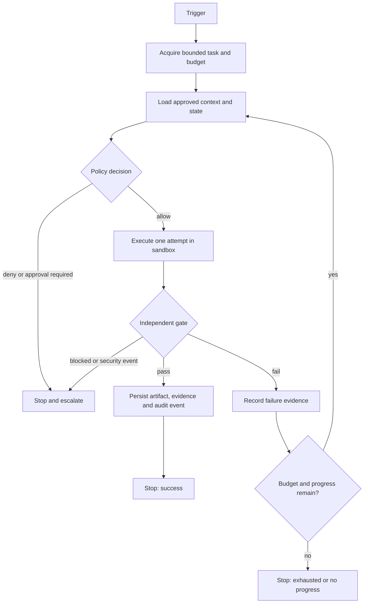

# Loop engineering

**Updated:** 2026-07-15
**Status:** bounded-loop contract; M2 read and M3 controlled-write primitives exist, autonomous scheduling does not

## TL;DR

A loop is not an infinite prompt. It is a bounded feedback system that performs one controlled attempt, verifies the result with an independent gate, records evidence, and repeats only while policy and budget allow it.

```text
Loop = trigger
     + bounded task
     + approved context
     + allowed capabilities
     + policy decision
     + attempt
     + independent gate
     + state
     + budget
     + approval
     + audit trail
     + hard stop
```

The first ecosystem loop should be read-only and proposal-only. No loop may grant itself permissions, change its own objective or evaluator, or silently continue after a policy denial.

## Why loops matter

A one-shot agent can produce an answer. A well-engineered loop can produce a repeatable, verified result and accumulate evidence for future runs. The value comes from feedback and objective verification, not from the number of retries.

A task is a good loop candidate when all of these are true:

- it repeats often enough to justify automation;
- success can be checked objectively;
- the task and side effects can be bounded;
- a failed attempt leaves useful evidence;
- the compute and review budget can absorb retries;
- irreversible actions can be proposed first or approved separately.

If success cannot be verified, repetition mainly multiplies cost and risk.

## Three different loops

The ecosystem separates three related concepts instead of calling all of them a self-improving agent.

| Type | Flow | Purpose |
|---|---|---|
| Execution loop | observe → plan → act → verify → repeat/stop | Complete one bounded task |
| Automation loop | trigger → task → policy → execution → gate → state | Run a verified workflow repeatedly |
| Learning loop | evidence → investigate → verify → distill → review | Improve curated knowledge or procedures |

An execution loop belongs inside one run. An automation loop schedules and governs runs. A learning loop proposes improvements to memory or skills. Combining them without separate permissions creates a system that can change both its behavior and the rules used to judge that behavior.

## Canonical state machine



Policy denial is terminal for the current action. The loop must not switch providers, tools, or routes to bypass the denial.

## Required LoopDefinition fields

Every executable loop should eventually have a versioned, machine-readable definition with at least these fields:

| Field | Required meaning |
|---|---|
| `id`, `version`, `owner` | Stable identity, contract version, accountable human/team |
| `trigger` | Manual, schedule, event, or approved API call |
| `task_schema` | Exact accepted input and bounded objective |
| `capabilities` | Requested model, tool, filesystem, network and action capabilities |
| `policy_class` | Data/action/zone/provider classification and denial behavior |
| `state` | State schema, storage, retention and trust level |
| `gate` | Exact evaluator, command, threshold and immutable inputs |
| `budget` | Maximum attempts, wall time, tokens/cost and resources |
| `retry` | Idempotency key, retry policy and duplicate-side-effect protection |
| `side_effect_mode` | Observe, propose, approve, or apply |
| `approval` | Actions that require a human or external policy decision |
| `hard_stops` | Exhaustion, no-progress, security and resource stop conditions |
| `incident_owner` | Escalation path and kill-switch owner |
| `result` | Artifact schema, provenance and acceptance record |
| `metrics` | Reliability, economics, safety and recovery signals |

This definition is a target contract. It must not be presented as enforced until M2–M4 runtime boundaries and negative tests exist.

## Gate design

The gate converts activity into measurable progress. Prefer deterministic evaluators:

- unit, integration and policy tests;
- compilation, lint and schema validation;
- invariants and boundary checks;
- reproducible benchmark metrics;
- comparison with an immutable baseline;
- provenance, signature and artifact-integrity checks.

A second LLM can review ambiguity, style, or semantics, but it is not a sufficient hard gate on its own. Where an LLM judge is unavoidable, pin the deployment and rubric, keep adversarial examples, calibrate it against human labels, and record disagreement rates.

The actor must not be allowed to modify its goal, protected evaluator, held-out test data, or acceptance threshold during a run.

## State and trust boundaries

State is evidence with a trust level, not automatic truth.

| State layer | Lifetime | Write rule |
|---|---|---|
| Run state | One execution | Loop may write within its isolated run |
| Experiment ledger | Append-only history | Record inputs, revisions, attempts, metrics and outcomes |
| Project memory | Cross-run verified facts | Update only after validation or review |
| Procedural skills | Reusable methods | Loop may propose; reviewed promotion is required |
| Audit trail | Security and accountability record | Append through trusted runtime boundary |

Do not copy raw retrieved content, tool output, webpages, issues, or model claims directly into trusted memory. Preserve provenance and pass the same content-safety and validation boundary used for normal inputs.

## Hard stops

Every loop needs more than `max_iterations`:

- maximum attempts;
- maximum wall-clock time;
- maximum token, money, GPU and storage budget;
- maximum consecutive failures;
- stop after repeated identical actions or errors;
- stop when the metric no longer improves;
- stop on environment or dependency drift;
- stop on policy, approval or capability failure;
- stop on resource, thermal or security limits;
- operator kill switch.

Exhaustion produces a typed incomplete result with evidence. It must never be reported as success.

## Side-effect and maturity levels

| Level | Behavior | Promotion evidence |
|---|---|---|
| L0 — Manual | Human runs a one-shot workflow | Task and expected result are understood |
| L1 — Repeatable | Stable script, no autonomous retry | Reproducible local runs |
| L2 — Observe | Loop reads and emits a report | Deterministic gate and repeated-run pass rate |
| L3 — Propose | Loop creates a patch, branch, plan, or artifact | Reviewable diff, provenance and rollback |
| L4 — Controlled apply | Approved writes inside enforced boundaries | Sandbox, PEP, idempotency, approval and negative tests |
| L5 — Evidence-compounding | Strategy may improve inside frozen objective/evaluator bounds | Longitudinal safety, quality, cost and recovery evidence |

Production or external-write loops stay disabled until M4 repeated-run promotion gates are implemented. M3 supplies only the narrowly approved one-file apply primitive; it does not authorize autonomous scheduling or broaden the action scope.

## Candidate 1: wiki-health-check

This is the recommended first loop because it is low-risk and has deterministic checks.

```text
manual trigger initially
→ read repository wiki and referenced documentation
→ detect broken links, missing metadata, stale pages and duplicates
→ produce a versioned report
→ run report/schema checks
→ stop
```

Initial boundaries:

- repository-scoped read access;
- no automatic wiki edits;
- no network access unless separately approved;
- report-only output under a controlled artifact path;
- fixed file, time and token limits;
- human acceptance before any proposed patch is applied.

Promotion path:

1. Make the checks reliable as a manual command.
2. Run them repeatedly against fixed fixtures.
3. Add report generation without writes to curated wiki pages.
4. Measure false positives, review time and recovery behavior.
5. Schedule only after repeated-run evaluation passes.

## Candidate 2: ml-autoresearch

This is a valuable second loop, but its evaluator and resource boundary are more sensitive.

Required safeguards:

- isolated experiment branch or worktree;
- immutable baseline, evaluator and held-out data;
- pinned environment, revision and random seeds;
- fixed attempt, GPU-time, thermal, storage and cost limits;
- append-only experiment ledger, including failed experiments;
- repeated verification of claimed improvements;
- no modification of protected tests or metrics;
- human approval before merge or model promotion.

`val_bpb < baseline` is useful only when the comparison is reproducible and statistically meaningful. A single lower value is evidence for investigation, not automatically an accepted improvement.

## Metrics

The principal economic metric is:

```text
cost per accepted change =
  (compute + human review + failed/reverted work + incident cost)
  / accepted changes
```

Track it alongside:

- accepted-change rate;
- repeated-run pass rate;
- false-positive and false-negative rate of the gate;
- unauthorized-action rate;
- human-review time;
- retry and no-progress rate;
- rollback and recovery success;
- escaped-defect or regression rate;
- resource use per accepted result.

Thresholds must come from the project baseline and risk class. Numbers quoted in source articles, such as a universal 50% acceptance threshold, are heuristics rather than ecosystem policy.

## What the ecosystem has today

Implemented today:

- canonical `.ai/` contracts and validation;
- deterministic instruction projections;
- audit, lock, drift, backup and uninstall foundations;
- default-deny runtime policy, immutable plans, budgets and trusted run/event ledger;
- Linux/WSL read isolation and exact-approved one-file create/replace with restart-safe rollback;
- a documented registry of loop candidates.

Not implemented today:

- loop scheduler or durable execution engine;
- a production multi-user approval service;
- cross-platform controlled-write backends;
- promotion evaluation for L2–L5 loops.

Therefore `wiki-health-check` and `ml-autoresearch` are candidates, not running autonomous services.

## Sources and evidence status

Normative local sources:

- [Current architecture](architecture.md)
- [Roadmap](roadmap.md)
- [Loop candidate registry](../loops/README.md)
- [Architecture decisions](../docs/decisions/README.md)
- Full ecosystem research: `/home/snow/projects/rnd-llm-playbook/docs/research/2026-07-14-universal-ai-ecosystem-deep-research.md`

Supporting concept sources:

- Agentic loop glossary: `/home/snow/projects/rnd-llm-playbook/concept/08-glossary.md`
- Agent workflow anti-patterns: `/home/snow/projects/rnd-llm-playbook/concept/05-anti-patterns.md`

The DGX Spark X-article corpus inspired several loop patterns, but it is secondary, unverified source material. Product claims, performance multipliers and universal numeric thresholds from those articles are not normative evidence for this project.

### Reviewed “Loop and Harness engineering” article

The supplied “7 files, 5 steps” article has been preserved and checked against primary sources in the [detailed source review](../docs/research/2026-07-15-loop-and-harness-engineering-source-review.md).

Accepted insight: the stable harness and iterative loop are separate layers, and loops need durable goals/state, context discipline, verification, and explicit continuation decisions.

Corrections that are normative for this project:

- `.claude/` is a Claude-specific projection, not the ecosystem harness or source of truth;
- no fixed seven-file set is required across providers or projects;
- hooks and MCP configuration are not substitutes for external policy enforcement, approval, sandboxing, and audit;
- fresh-context LLM review is useful evidence but not automatically an independent hard gate;
- the cited 91.6% and 90.2% results are workload-specific, not universal performance guarantees;
- no loop runs forever: budgets, no-progress detection, terminal outcomes, incident ownership, and a kill switch remain mandatory.
